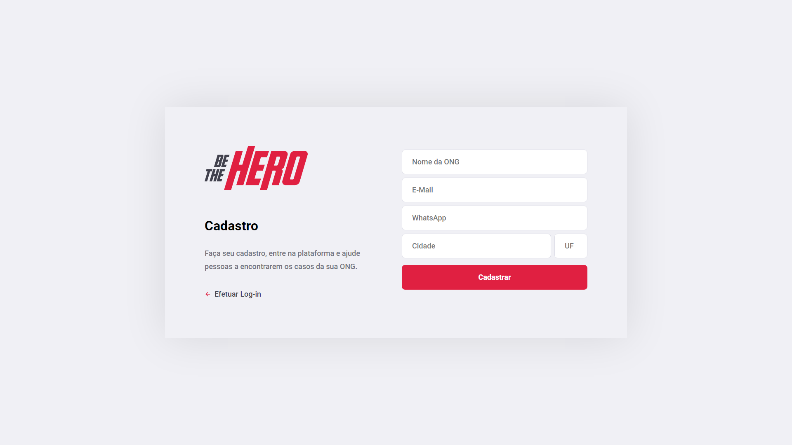

# Semana-OmniStack-11
## Resumo

Aplicação desenvolvida durante a semana OmniStack 11, feita pela [RocketSeat](https://github.com/Rocketseat), utilizando como tecnologias:

* **[NodeJS](https://nodejs.org/en/)** para o Back-End
* **[ReactJS](https://pt-br.reactjs.org/)** para o Front-End
* **[React Native](https://reactnative.dev/)** para o Mobile

## Objetivo

Criar um ambiente na qual ONGs possam registrar seus casos que exijam ajuda monetária para que usuários possam visualizar e oferecer ajuda através de um aplicativo.

## Módulos

### Back-End

Desenvolvido em [NodeJS](https://nodejs.org/en/), que sustenta uma API RESTful que trabalha com um banco de dados e as relações entre tabelas do mesmo. Ela trabalha com requisições HTTP *GET*, *POST* e *DELETE*, sendo seus endpoints:

#### Retornar todas as ONGs

##### Requisição
```
GET /ongs
```

##### Resposta
```
BODY: [
    {
        "id": "00000000",
        "name": "nome",
        "email": "email@email.com",
        "whatsapp": "+55000000000",
        "city": "cidade",
        "uf": "XX"
    },
    ...
]
```

#### Cadastrar Nova ONG

##### Requisição
```
POST /ongs
BODY: {
    "id": "00000000",
    "name": "nome",
    "email": "email@email.com",
    "whatsapp": "+55000000000",
    "city": "cidade",
    "uf": "XX"
}
```

##### Resposta
```
BODY: {
    "id": "00000000"
}
```

#### Listar todos os Casos

##### Requisição
```
GET /incidents?page=<número>
```
Parâmetro ``page`` precisa ser um número, caso ultrapasse o limite de páginas retornará um Array vazio. O valor padrão é ``1``.

##### Resposta
```
HEADERS: [
    X-Total-Count: 0,
    ...
]

BODY: [
    {
        "id": "0",
        "name": "nome",
        "email": "email@email.com",
        "whatsapp": "+55000000000",
        "city": "cidade",
        "uf": "XX",
        "title": "título",
        "description": "descrição",
        "value": 0,
        "ong_id": "00000000",
        "whatsapp": "+55000000000"
    },
    ...
]
```
O cabeçalho ``X-Total-Count`` representa o total de casos que existem no banco de dados.

#### Criar um novo Caso

##### Requisição
```
POST /incidents
HEADERS: [
    Authorization: "00000000",
    ...
]

BODY: {
    "title": "título",
    "description": "descrição",
    "value": 0
}
```
O cabeçalho ``Authorization`` precisa conter o ``id`` da ONG.

##### Resposta
```
BODY: {
    "id": 1
}
```

#### Excluir um Caso

##### Requisição
```
DELETE /incidents/:id
HEADERS: [
    Authorization: "00000000",
    ...
]
```
O parâmtro ``id`` deve ser o identificador único do caso recebido na criação do mesmo.
O cabeçalho ``Authorization`` precisa conter o ``id`` da ONG.

##### Resposta
```
204 No Content
```

#### Efetuar Login

##### Requisição
```
POST /sessions
BODY: {
    "id": "00000000"
}
```

##### Resposta
```
BODY: {
    "name": "nome"
}
```

#### Listar todos os casos de uma ONG

##### Requisição
```
GET /profile
HEADERS: [
    Authorization: "00000000",
    ...
]
```
O cabeçalho ``Authorization`` precisa conter o ``id`` da ONG.

##### Resposta
```
BODY: [
    {
        "id": 0,
        "title": "título",
        "description": "descrição",
        "value": 0,
        "ong_id": "00000000"
    },
    ...
]
```

### Front-End

Desenvolvido em [ReactJS](https://pt-br.reactjs.org/), é a interface gráfica na qual as ONGs utilizarão para gerenciar seus casos. Trabalha com 4 telas, sendo elas:

#### Login

##### Endereço
``/``

##### Imagem


#### Cadastro

##### Endereço
``/register``

##### Imagem



#### Gerenciamento de Casos

##### Endereço
``/profile``

##### Imagem


#### Cadastro de Caso

##### Endereço
``/incidents/new``

##### Imagem


### Mobile
Desenvolvido em [ReactJS](https://pt-br.reactjs.org/), é a interface gráfica na qual pessoas utilizarão para contribuir com casos de todas as ONGs da plataforma. Trabalha com 2 telas, sendo elas:

#### Home


#### Detalhes de Caso

